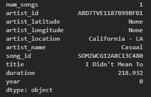
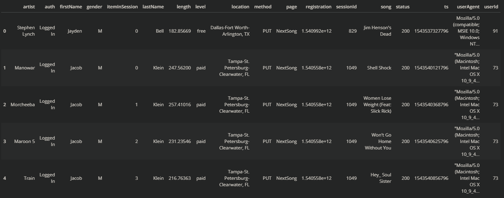
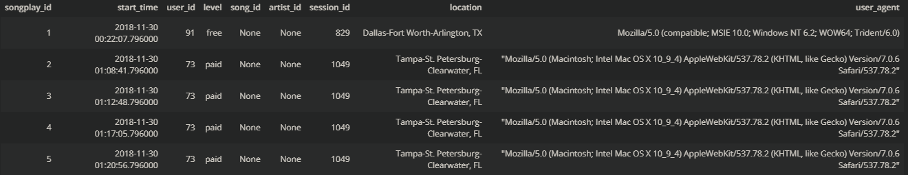
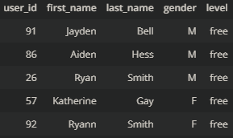
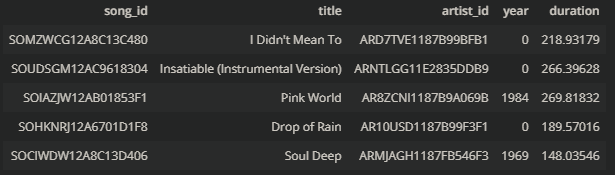
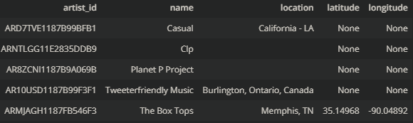
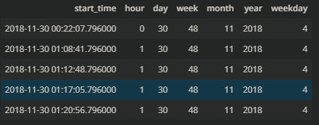

# Data Lake in s3 for Sparkify 

## Project Scope 
### Short description
This project has the purpose of model data lake using AWS s3 and Apache Spark for data created by 'Sparkify' tech company. The idea is to make relational, normalized database, as there is not much data to cover and it will be easy to model the data and do the joins between datasets, which can be useful for many different analyses. 

### Input data

Input data should be taken from s3 buckets, where there are 2 directories: one for log data, one for songs. This should be copied directly to s3, which will contain database (lake). 

Example of the song data when changed to pandas Series using *pd.read_json(PATH, typ='series')*:

Example of the log data when changed to pandas DataFrame using *pd.read_json(PATH, lines=True)*:

Credentials on AWS should be saved in dl.cfg file attached to this project in a main directory. However, due to the fact that this information is confidential, the file should not be attached to this project in github (or any other git platform). Config file should be following the structure described in python functions (*create_tables.py* and *etl.py*). 

### Output of the project and schema of the database

In detail, this project does:
- create the relational database following the star schema,
    - songplay (primary),
    - users,
    - songs,
    - artists,
    - time.
- reads the data created by the infrastructure and saved in the '/data' directory,
- preprocesses (transforms) the data,
- loads the data into datasets.

Data is prepared in the way that should be easily joined together when needed via primary keys for each dataset.

### Result

Examples of the data are presented below:

    

    

## Prerequisites
Please check the libraries in each of the .py files to find out which libraries should be installed in your venv.

## How to use?
How the data engineering should be done (from scratch)?
- Activate the s3,
- Create dl.cfg file in main directory and save the necessary information,
- Open the terminal,
- Run 'etl.py'.

# TODO
- make the code more robust to errors,
- make the code more robust to infrastructure being down,